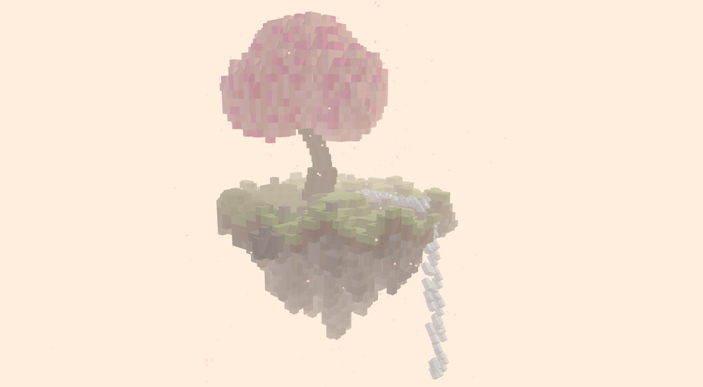

# 🌸 Floating Voxel Sakura Island

A beautiful 3D voxel art scene featuring a floating island with a cherry blossom tree, a waterfall, and falling petals. Built using **Three.js** and **InstancedMesh** for high performance.

## ✨ Features
- **Dynamic Waterfall**: Animated water particles flowing from the island.
- **Falling Petals**: Gentle cherry blossom petals drifting through the wind.
- **Floating Animation**: The entire island subtly bobs up and down.
- **Interactive Controls**: 
  - **Drag**: Rotate the camera.
  - **Scroll**: Zoom in and out.
- **Optimized Rendering**: Uses `InstancedMesh` to render hundreds of voxels efficiently at 60 FPS.

## 🚀 How to Run
Simply open `index.html` in any modern web browser.

## 🛠️ Built With
- [Three.js](https://threejs.org/) - 3D Engine
- [SimplexNoise](https://github.com/jwagner/simplex-noise.js) - For procedural island generation
